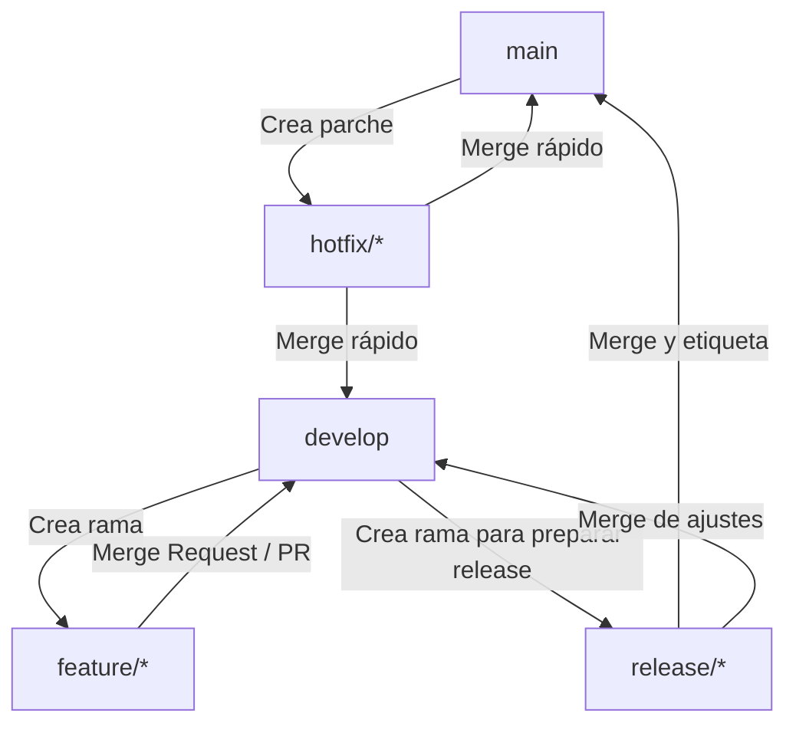

# Guía de GitFlow y Convenciones del Proyecto

Este documento describe la metodología de GitFlow adoptada para el desarrollo de este proyecto, junto con las convenciones de nombres para ramas y confirmaciones (commits).

---

## 1. El Flujo de Trabajo (GitFlow)

GitFlow es un modelo de ramificación diseñado para la gestión de lanzamientos y desarrollo ordenado. Estructura el historial del proyecto en ramas específicas con roles definidos.



### Ramas Principales (Infinitas)

#### `main`

* **Propósito:** Contiene el código de producción listo para el usuario final. Todo lo que esté en `main` debe ser estable y funcional.
* **Cuándo usarla:** Solo se actualiza mediante fusiones (merges) provenientes de ramas de `release/*` o `hotfix/*`.
* **Regla:** Nunca se debe trabajar o hacer commit directamente en `main`.

#### `develop`

* **Propósito:** Es la rama principal de integración para el desarrollo. Contiene el último estado entregado de las características terminadas para la próxima versión.
* **Cuándo usarla:** Sirve como base para crear ramas `feature/*` y es el destino al que se integran una vez completadas.

---

### Ramas de Apoyo (Temporales)

#### `feature/*` (Características / Funcionalidades)

* **Propósito:** Desarrollar nuevas características o refactorizaciones.
* **Origen:** `develop`
* **Destino:** `develop`
* **Comandos de Git:**
  ```bash
  # Crear y cambiar a la rama de feature
  git checkout develop
  git pull origin develop
  git checkout -b feature/nombre-de-la-funcionalidad

  # Desarrollar y confirmar cambios...
  git add .
  git commit -m "feat(ui): agregar sección de desarrolladores"

  # Subir la rama al repositorio remoto
  git push -u origin feature/nombre-de-la-funcionalidad
  ```

  *Nota: Para integrar en `develop`, se prefiere abrir un Pull Request (PR) en GitHub para revisión de código.*

#### `release/*` (Preparación de Lanzamiento)

* **Propósito:** Preparar una versión para producción. Permite correcciones menores de errores de última hora y preparación de metadatos (versión, documentación).
* **Origen:** `develop`
* **Destino:** `main` y `develop`
* **Comandos de Git:**
  ```bash
  # Crear rama de release (ej: versión 1.0.0)
  git checkout develop
  git pull origin develop
  git checkout -b release/v1.0.0

  # Realizar ajustes finales de estabilización si es necesario y luego fusionar en main:
  git checkout main
  git pull origin main
  git merge --no-ff release/v1.0.0
  git tag -a v1.0.0 -m "Versión 1.0.0"
  git push origin main --tags

  # También se debe fusionar de vuelta a develop para mantener los cambios:
  git checkout develop
  git merge --no-ff release/v1.0.0
  git push origin develop

  # Eliminar la rama local y remota de release
  git branch -d release/v1.0.0
  ```

#### `hotfix/*` (Correcciones Urgentes)

* **Propósito:** Corregir errores críticos encontrados en producción de manera inmediata sin interferir con el desarrollo en curso.
* **Origen:** `main`
* **Destino:** `main` y `develop`
* **Comandos de Git:**
  ```bash
  # Crear rama de hotfix desde main
  git checkout main
  git pull origin main
  git checkout -b hotfix/corregir-error-critico

  # Aplicar la solución y hacer commit
  git add .
  git commit -m "fix(core): corregir desbordamiento en el layout"

  # Fusionar en main y etiquetar
  git checkout main
  git merge --no-ff hotfix/corregir-error-critico
  git tag -a v1.0.1 -m "Hotfix v1.0.1"
  git push origin main --tags

  # Fusionar en develop
  git checkout develop
  git merge --no-ff hotfix/corregir-error-critico
  git push origin develop

  # Eliminar la rama
  git branch -d hotfix/corregir-error-critico
  ```

---

## 2. Convención de Nombres para Ramas

El nombre de la rama debe seguir la estructura: `<tipo>/<descripción-breve>` (en minúsculas y usando guiones `-` para separar palabras).

| Tipo de Rama                                      | Prefijo                    | Ejemplo                          |
| :------------------------------------------------ | :------------------------- | :------------------------------- |
| Nueva funcionalidad / característica             | `feature/`               | `feature/login-validation`     |
| Corrección de errores en desarrollo              | `bugfix/`                | `bugfix/responsive-footer`     |
| Corrección de errores urgente en producción     | `hotfix/`                | `hotfix/broken-payment-button` |
| Tareas de mantenimiento, CI/CD o refactorización | `chore/` o `refactor/` | `chore/update-dependencies`    |
| Preparación de lanzamiento                       | `release/`               | `release/v2.1.0`               |

---

## 3. Convención de Mensajes de Commit (Conventional Commits)

Utilizaremos la especificación de **Conventional Commits** para mantener un historial limpio, legible y automatizable.

### Estructura del Mensaje

```
<tipo>(<alcance>): <descripción corta en imperativo>

[cuerpo opcional para dar contexto detallado]

[pie de página opcional para referenciar issues/tickets, ej: Closes #123]
```

### Tipos de Commit (`<tipo>`)

* **`feat`**: Nueva funcionalidad para el usuario final (ej: `feat(api): agregar endpoint de login`).
* **`fix`**: Corrección de un error (ej: `fix(auth): corregir expiración de token`).
* **`docs`**: Cambios exclusivos en la documentación (ej: `docs: actualizar guía de instalación`).
* **`style`**: Cambios que no afectan el significado del código (espaciado, formateo, punto y coma omitidos, etc.).
* **`refactor`**: Reorganización de código que no corrige un error ni añade funcionalidad.
* **`perf`**: Cambio de código destinado a mejorar el rendimiento.
* **`test`**: Añadir o corregir pruebas existentes.
* **`chore`**: Tareas repetitivas, configuración de herramientas, dependencias o builds (ej: `chore(deps): actualizar axios`).

### Reglas Clave:

1. **Imperativo:** Escribe el título del commit en presente imperativo (ej: "agregar botón" en lugar de "agregado botón" o "agrega botón").
2. **Minúsculas:** El título debe comenzar con minúscula después del tipo y los dos puntos.
3. **Alcance opcional:** El `<alcance>` (ej: `(ui)`, `(auth)`) ayuda a identificar el módulo afectado.
